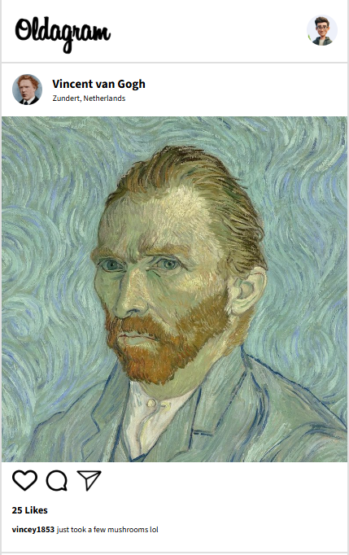

# Oldgram
A simple Instagram-like feed built with **HTML**, **CSS**, and **JavaScript**, featuring dynamic post rendering and interactive like functionality.

## 📷 Screenshot


## 📌 Features
- **Dynamic Rendering** – Posts are loaded from a JavaScript array.  
- **Like on Click** – Click the heart icon to like a post.  
- **Double-Tap to Like** – Double-click the post image to trigger a like.  
- **Live Like Count** – Updates instantly without page reload.  

## 🛠️ Tech Stack
- **HTML5** – Structure  
- **CSS3** – Styling & Layout  
- **JavaScript (Vanilla)** – DOM manipulation & event handling  

## 🚀 How It Works
1. The posts are stored in a JavaScript array containing user info, captions, and images.  
2. JavaScript dynamically generates the HTML structure for each post.  
3. Event listeners are attached to:  
   - The **heart icon** → toggles like  
   - The **post image** → detects double-click to like  
4. The like count updates immediately in the DOM.  

 📂 Installation & Usage
1. Clone this repository:
   ```bash
   git clone https://github.com/yourusername/instagram-like-feed.git
   ```
2.Open index.html in your browser.

💡 Lessons Learned
-Attaching event listeners dynamically to multiple elements

-Handling double-click events in JavaScript

-Avoiding duplicate id issues in dynamic DOM creation

🔗 [Live Preview](https://myoldgram.netlify.app)

